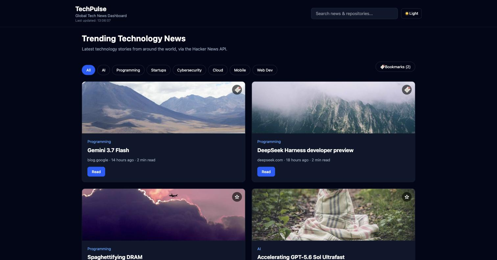
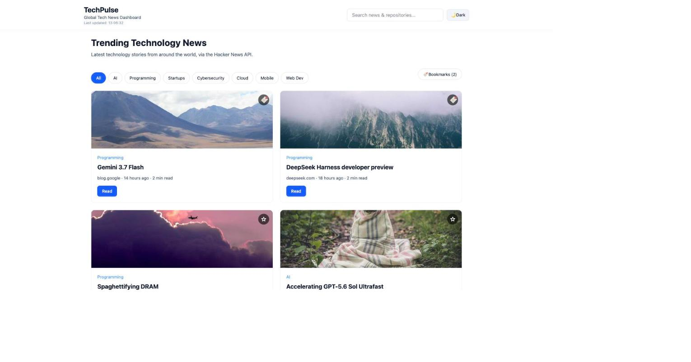
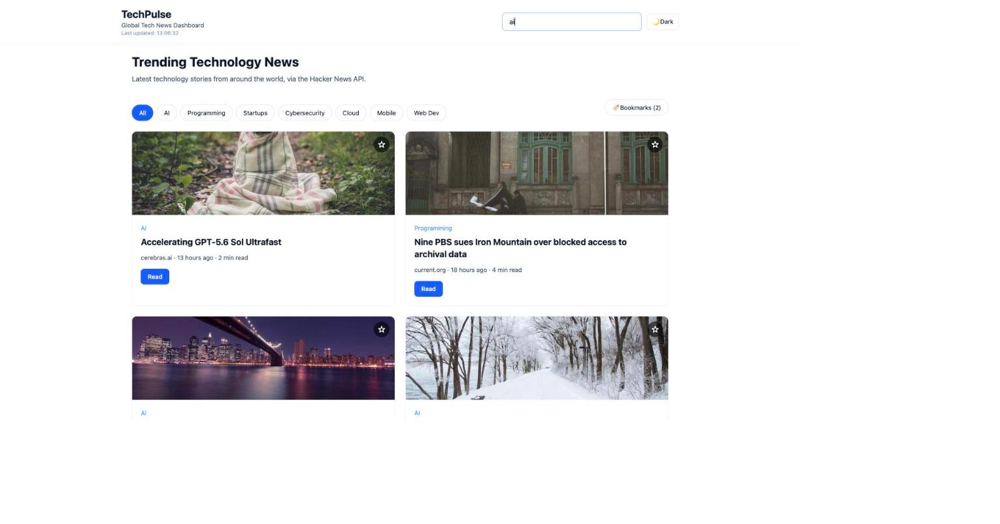
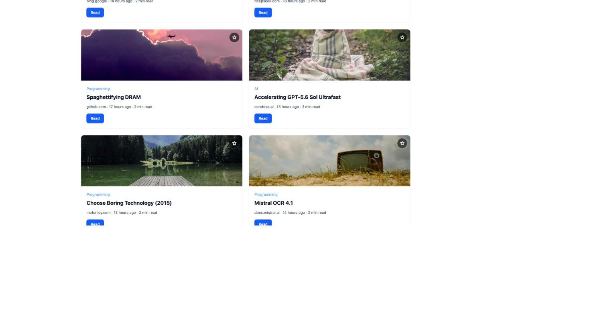
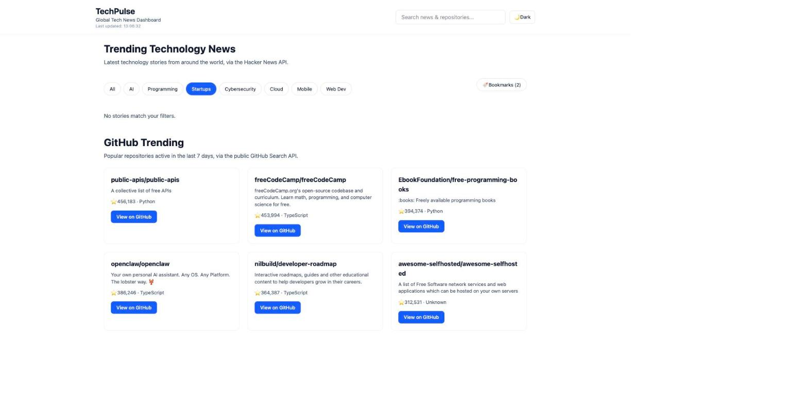
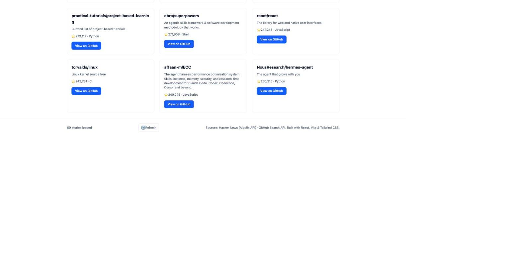

# TechPulse - Global Tech News Dashboard

**Live demo:** [global-tech-news-dashboard.vercel.app](https://global-tech-news-dashboard.vercel.app/)

Day 3 Assignment 2: a frontend-only dashboard that surfaces trending technology
news and trending GitHub repositories, with search, category filtering,
bookmarks, and dark/light mode.

## Features

- **Trending News** - live headlines from Hacker News, each with source,
  publish time, estimated reading time, thumbnail and a Read button.
- **Category filters** - AI, Programming, Startups, Cybersecurity, Cloud,
  Mobile, Web Dev (instant, client-side).
- **Search** - one search box filters news (headline/category) and GitHub
  repositories (name/description/language) at the same time, case-insensitive.
- **GitHub Trending** - popular repositories active in the last 7 days, via
  GitHub's public Search API.
- **Bookmarks** - save/unsave any story; stored in `localStorage`, so they
  survive a page refresh. A "Bookmarks" toggle filters the list down to
  saved stories only.
- **Infinite scroll** - news loads a handful of stories at a time and loads
  more automatically as you scroll, using `IntersectionObserver`.
- **Skeleton loading** - placeholder cards while news/GitHub data is loading,
  so the screen is never blank.
- **Dark / light mode** - a toggle in the header switches the whole app,
  including news, GitHub Trending, bookmarks, skeletons, footer and
  error/loading states.
- **Footer** - total stories currently loaded, a Refresh button (re-fetches
  news and GitHub data and updates "Last updated"), and source credits.
- **Responsive** - usable on desktop, tablet and mobile.

## Screenshots

| Dashboard (dark) | Dashboard (light) |
| --- | --- |
|  |  |

| Category filter | Search (news + repos) |
| --- | --- |
|  |  |

| Infinite scroll | GitHub Trending |
| --- | --- |
|  |  |

| Footer |
| --- |
|  |

## Tech stack

- React 19 + Vite
- Tailwind CSS 4
- Fetch API (no HTTP client libraries)
- Browser `localStorage` (no database, no login)
- ESLint

No backend, no authentication, no API keys.

## Running locally

```bash
npm install
npm run dev
```

Then open the printed local URL (typically `http://localhost:5173`).

Other scripts:

```bash
npm run lint    # ESLint
npm run build   # production build
npm run preview # preview the production build
```

## Data sources

- **News** - [Hacker News Algolia Search API](https://hn.algolia.com/api)
  (`tags=front_page`). Public, no key required, CORS-enabled. Categories and
  reading time are estimated client-side (Hacker News doesn't provide them);
  thumbnails are decorative placeholders since the feed has no images.
- **GitHub Trending** - [GitHub Search API](https://docs.github.com/en/rest/search)
  (`/search/repositories`, sorted by stars, restricted to repos pushed to in
  the last 7 days). Public, no token required. GitHub's free API does not
  expose "stars gained today", so live repo cards omit a growth number
  rather than making one up.

### CORS / fallback behavior

Both data sources are fetched directly from the browser with the Fetch API.
If a request fails (offline, CORS, rate limiting, etc.), the app does not
crash or show a blank screen - it falls back to clearly labeled sample data
(`src/data/sampleNews.js`, `src/data/sampleRepos.js`) and shows a small
banner explaining that live data is unavailable. Any non-live card is marked
with a "Sample" badge so it's never mistaken for real data.

## Project structure

```
src/
  components/   Header, CategoryFilter, NewsCard, SkeletonCard,
                GithubTrending, RepoCard, Footer
  hooks/        useNewsFeed, useGithubTrending, useBookmarks,
                useLocalStorage, useInfiniteScroll
  data/         sampleNews.js, sampleRepos.js (fallback data only)
  utils/        newsUtils.js (category guess, reading time, time-ago, etc.)
  App.jsx
  main.jsx
  index.css
```
